# 프로젝트명: 터렛 디펜스(이지훈)  

 

# 목차  
[1. 컨셉](#1-컨셉)  
  &nbsp;&nbsp;&nbsp;&nbsp;\* 메인 컨셉  
  &nbsp;&nbsp;&nbsp;&nbsp;\* 서브 컨셉  
[2. 이미지](#2-이미지)  
  &nbsp;&nbsp;&nbsp;&nbsp;\* 관련 이미지와 동영상  
  &nbsp;&nbsp;&nbsp;&nbsp;\* 대표 이미지  
[3. 터렛 디펜스 구성 요소](#3-터렛-디펜스-구성-요소)  
  &nbsp;&nbsp;&nbsp;&nbsp;\* 메커니즘  
  &nbsp;&nbsp;&nbsp;&nbsp;\* 이야기  
  &nbsp;&nbsp;&nbsp;&nbsp;\* 미적요소  
  &nbsp;&nbsp;&nbsp;&nbsp;\* 기술  
[4. 구성 요소 분석](#4-구성-요소-분석)  
  &nbsp;&nbsp;&nbsp;&nbsp;\* 게임 오브젝트 분해  
  &nbsp;&nbsp;&nbsp;&nbsp;\* 파라미터(속성) 뽑아 보기   
  &nbsp;&nbsp;&nbsp;&nbsp;\* 행동 뽑아 보기   
  &nbsp;&nbsp;&nbsp;&nbsp;\* 상태 뽑아 보기   
 

# 1. 컨셉  

## 메인 컨셉 : 전략적  

- 단순히 플레이 하는 것이 아니라 유저가 생각하고 고민하여 실시간으로 상황에 따라 여러 게임 기능과 오브젝트를 이용해 대응한다  
- 다양한 적, 다양한 터렛 그리고 배치가능한 타일과 한정된 재화,시간을 이용해 스테이지를 클리어하며 유저가 전략성을 느끼게 한다  

 

### 서브 컨셉 1 : 다양성  

- 상황과 적의 종류에 따라 대응할 수 있는 기능과 성능을 가진 여러 오브젝트가 존재  
- 각각의 적이 가진 약점을 공략할 수 있는 터렛과 그 외에도 특수한 다른 기능을 가진 터렛들을 제공하여 다양성을 느끼게 한다  

 

### 서브 컨셉 2 : 맵  

- 맵 별로 배치 가능 위치를 조절하여 난이도를 조절해 유저가 고민을 통해 좀 더 효율적인 배치와 타이밍을 찾을 수 있다  
- 적이 오는 길을 제외한 모든 곳에 포탑을 설치할 수 있는 것이 아니라 맵의 구조와 지형지물을 이용해 설치할 수 있는 노드를 조절하여 유저가 고민을 통해 각 상황마다 효율적인 배치를 할 수 있게 만든다. 예를 들면 맵 곳곳에 물이나 낭떨어지 같은 지형을 만들어 그 지형에만 설치할 수 있는 터렛을 사용해야 하게 만든다  
- 맵에 적이 나올 입구를 여러 곳 만들어서 스테이지가 진행되며 적이 번갈아 나오게 하여 한 곳만 막는 것이 아니라 다른 곳도 막게 하여 배치를 고민하게 만든다  
- 최대 50스테이지 정도를 생각중 

 

### 서브 컨셉 3 : 순발력  

- 각 스테이지가 끝날 때 마다 사이사이에 정해진 준비 시간 동안 어떤 적이 몇 명 나올지, 어느 입구에서 나올지 유저에게 알려주어 미리 설치할 장소와 설치할 포탑을 생각하게 하고 스테이지가 뒤로 갈수록 준비 시간을 줄어들게 하여 순발력을 느끼게 한다  
- 준비 시간에 남은 시간은 상단에 표시  
- 적을 잡는 동안 실시간으로 얻는 재화를 이용해 부족한 위치에 터렛을 설치해 순발력 있게 대응하게 한다  

 

### 서브 컨셉 4 : 계산  

- 스테이지가 올라갈수록 적의 체력과 난이도가 올라가기 때문에 실시간으로 대응할 수 있는 터렛을 구매할 재화를 적의 스펙에 맞게 지급하고 스테이지 클리어시 일정량의 재화를 추가로 지급하여 전 스테이지가 진행될 때 실시간으로 사용된 재화를 어느 정도 메꿔주어 준비 시간에 상점에서 다음 스테이지 초반을 버티고 대응할 포탑을 가진 금액에 맞게 효율적으로 계산하여 구매하게 한다  
- 너무 적이 강해져 막는대 실패해서 체력이 줄어들 때 마다 소량의 재화를 추가 지급하여 스테이지를 클리어하는데 도움이 되도록 한다  
- 체력이 줄어들면 클리어시 지급되는 점수나 뱃지같은게 줄어들게 하여 클리어 후 유저가 높은점수를 위해 다시 도전하게 만든다  

 

### 서브 컨셉 5 : 희열감  

- 위에 언급한 기능들을 이용해 스테이지가 진행될 수록 난이도를 점차 올려 클리어시 유저가 희열감을 느끼게 한다  
- 적이 길 끝에 도달시 남은 체력이 깎이게 하여 게임 클리어시 남아 있는 체력 기준으로 점수 또는 뱃지나 별을 지급해 높은 점수일 수록 성취감과 희열감을 느끼게 만든다  

 

### 서브 컨셉 4 : 타격감  

- 각 터렛이 발사하는 탄환의 종류에 맞는 사운드와 이펙트를 넣고 그 포탑을 강화했을 때 업그레이드 된 이펙트를 통해 유저가 자신의 마음에 드는 포탑을 구매하게 만들고 타격감을 느끼게 만든다  

 

[맨위로](#)

  

# 2. 이미지  

## 관련 이미지와 동영상  

이미지 접기/펼치기

  
- 이미지
 
  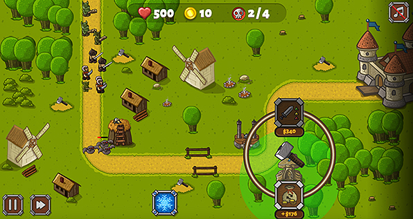  
  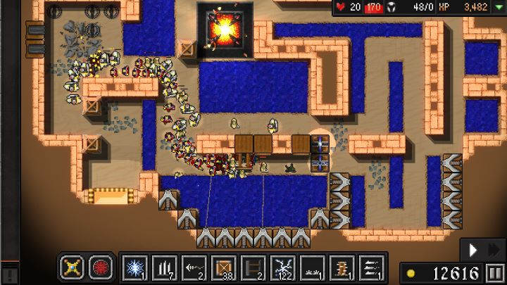  
  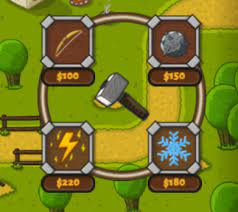
 
- 동영상  
  [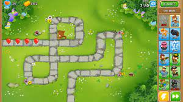](https://www.youtube.com/watch?v=n72JYDLRSZI)

 

## 대표 이미지  

이미지 접기/펼치기

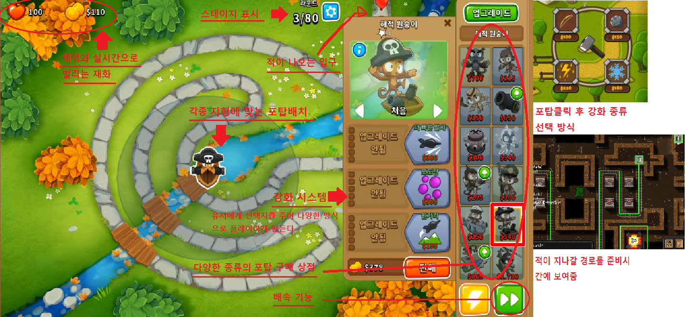

 

[맨위로](#)

  

# 3. 터렛 디펜스 구성 요소  

- 여러 터렛을 이용해 적을 막아내는 디펜스 게임  

## 메커니즘  

[도전 과제]  

1. 터렛을 설치하여 몰려오는 적을 끝 지점에 도착하기 전에 모두 쓰러트린다   
2. 최대한 체력을 많이 남겨 높은 점수 또는 뱃지를 얻는다  

[재미 요소]  

1. 스테이지가 진행될수록 적이 단단해지고 끝에 도달 했을 때 들어오는 데미지가 늘어난다  
2. 또한 적이 주는 재화가 점점 늘어나서 여러개의 포탑을 구매하여 설치 할 수 있다  
3. 각기 다른 효과를 지닌 여러 포탑을 구매하여 사용해 볼 수 있다  
4. 클리어 했을 때 남아있는 체력에 따라 점수나 등급 별 뱃지를 받을 수 있다    

 

## 이야기  

[만들게 된 배경]  
전부터 디펜스 게임을 좋아해서 직접 만들어 보고 싶었다  

[카메라 관점]  
탑뷰 화면으로 게임을 진행하여 자신이 원하는 위치에 포탑을 설치 할 수 있게 한다

 

## 미적요소  

[디자인][컬러]  
나오는 적이 스테이지에 따라 달라지고 설치 할 수 있는 포탑들과 포탑의 이펙트가 각기 다른 디자인과 컬러를 가지고 있다  

[음향]  
포탑에서 공격이 나갈 때 소리가 포탑 컨셉에 맞게 각기 다르고 적이 피격하여 이펙트가 터질 때 소리도 이펙트에 맞게 설정한다

 

## 기술  

Unity를 이용해 개발. 플레이 시 마우스 만으로도 플레이 할 수 있게 하고 원한다면 키보드 단축키를 이용해 익숙해진다면 좀 더 빠르고 편리하게 플레이 할 수 있도록 몇몇 기능들을 여러 키에 배치한다  

 

[맨위로](#)

  

# 4. 구성 요소 분석  

## 게임 오브젝트 분해 

표 접기/펼치기

  
|연번|종류|오브젝트 이름|오브젝트 영문명|사용처|오브젝트 이미지|
|:----:|:----:|:----:|:----:|:----:|:----:|
|1|에너미|에너미1_병아리|Enemy1_chick|스테이지 1~4|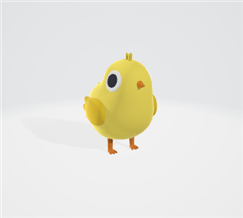|
|2|보스|보스1_닭|Boss1_chicken|스테이지 5|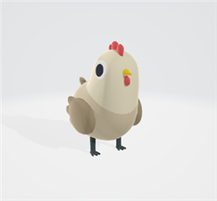|
|3|에너미|에너미2_새|Enemy2_bird|스테이지 6~9|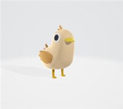|
|4|보스|보스2_피닉스|Boss2_pheonix|스테이지 10||
|5|에너미|에너미3_양|Enemy3_sheep|스테이지 11~14|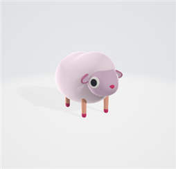|
|6|보스|보스3_기린|Boss3_kirin|스테이지 15|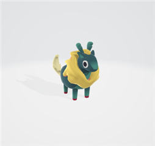|
|7|에너미|에너미4_개|Enemy4_dog|스테이지 16~19|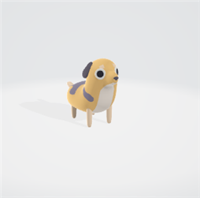|
|8|보스|보스4_케르베로스|Boss4_cerberus|스테이지 20|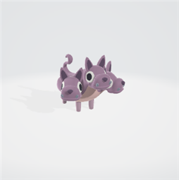|
|9|에너미|에너미5_당나귀|Enemy5_donkey |스테이지 21~24|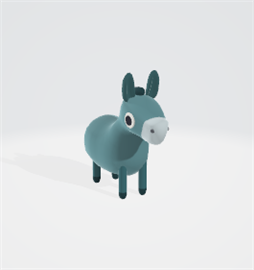|
|10|보스|보스5_페가수스|Boss5_pegasus|스테이지 25|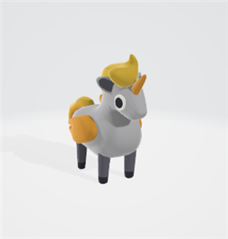|
|11|에너미|에너미6_젖소|Enemy6_milkcow|스테이지 26~29|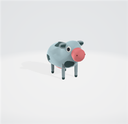|
|12|보스|보스6_뿔소|Boss6_horncow|스테이지 30|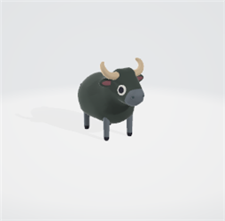|
|13|에너미|에너미7_돼지|Enemy7_pig|스테이지 31~34|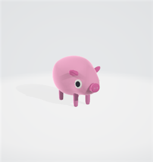|
|14|보스|보스7_고래|Boss7_whale|스테이지 35|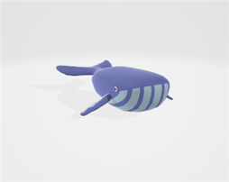|
|15|에너미|에너미8_여우|Enemy8_fox|스테이지 36~39|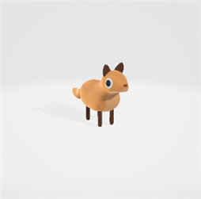|
|16|보스|보스8_구미호|Boss8_kitsune|스테이지 40|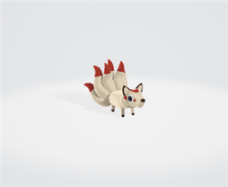|
|17|에너미|에너미9_레비아탄|Enemy9_leviathan|스테이지 41~44||
|18|보스|보스9_동양용|Boss9_dragon1|스테이지 45|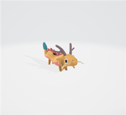|
|19|에너미|에너미10_와이번|Enemy10_wyvern|스테이지 46~49|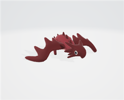|
|20|보스|보스10_용|Boss10_dragon2|스테이지 50|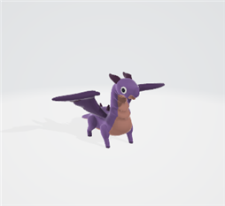|
|21|터렛|기본총알터렛|Basicbullet_Turret|공통|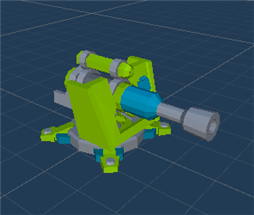|
|22|터렛|화염터렛|Fire_Turret|공통||
|23|터렛|폭발터렛|Splash_Turret|공통|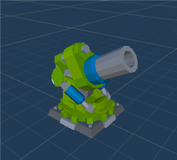|
|24|터렛|독터렛|Poison_Turret|공통||
|25|터렛|버프타워|Buff_Tower|공통|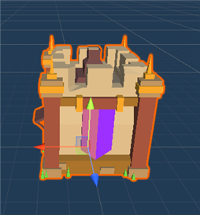|
|26|UI|재화|Coin|공통|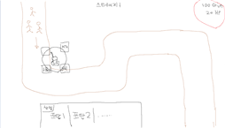|
|27|UI|체력|HP|공통||
|28|UI|스테이지|Stage|공통|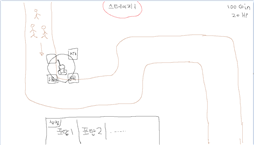|
|29|UI|상점|Shop|공통|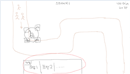|
|30|UI|강화|Reinforce|공통||
|31|UI|설정|Setting|공통|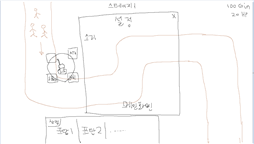|

  

 

## 파라미터(속성) 뽑아 보기  

오브젝트 이름 : Basicbullet_Turret, Fire_Turret, Splash_Turret, Poison_Turret, Buff_Tower  
|속성|영문명칭|설명|비고|
|:----:|:----:|:----:|:----:|
|공격력|Turret_Atk|터렛의 공격력||
|공격속도|Turret_Speed|터렛의 공격속도||
|상태|Turret_Status|터렛의 행동상태, 공격, 가격 등||
|레벨|Turret_Level|강화ui에서 강화시 레벨 상승(스텟증가)||

 

오브젝트 이름 : Enemy1\~10, Boss1\~10  
|속성|영문명칭|설명|비고|
|:----:|:----:|:----:|:----:|
|체력|Enemy(Boss)_Hp|각 몬스터와 보스의 체력 수치||
|스피드|Enemy(Boss)_Speed|각 몬스터와 보스의 이동 속도||
|상태|Enemy(Boss)_Status|각 몬스터와 보스의 행동상태, 이동, 체력 등||

 

## 행동 뽑아 보기  

오브젝트 이름 : Basicbullet_Turret, Fire_Turret, Splash_Turret, Poison_Turret, Buff_Tower  
|행동|설명|
|:----:|:----:|
|조준|몬스터가 터렛 범위에 들어오면 몬스터의 위치 방향으로 머리가 돌아감|
|발사|조준 후에 총구앞에서 총알을 발사|
|유도|발사한 총알이 실시간으로 이동하는 몬스터위치로 유도되어 착탄|
|강화|설치된 포탑을 클릭 시 강화ui가 오픈되고 재화를 사용하여 강화됨|

 

오브젝트 이름 : Enemy1\~10, Boss1\~10  
|행동|설명|
|:----:|:----:|
|스테이지|스테이지 별로 지정된 수량의 각기 다른 몬스터가 나옴|
|웨이브|각 스테이지의 웨이브에서 지정된 몬스터가 각 웨이포인트를 지나 마지막 지점에 도달|
|사망|터렛이 발사한 탄환에 맞고 체력이0이 되면 파괴, 웨이포인트 마지막 지점에 도착해도 파괴|

 

오브젝트 이름 : HP  
|행동|설명|
|:----:|:----:|
|줄어듬|몬스터가 웨이포인트 마지막 지점에 도달하면 최대 hp에서 숫자가 줄어듬|
|패배|hp가 0이 되면 패배하고 게임종료|

 

## 상태 뽑아 보기  

오브젝트 이름 : Basicbullet_Turret, Fire_Turret, Splash_Turret, Poison_Turret, Buff_Tower  
|현상태|전이상태|전이조건|
|:----:|:----:|:----:|
|정상상태|버프상태|버프 타워 반경 안에 설치되어 있을 경우|
|정상상태|강화상태|설치 된 터렛을 클릭하여 강화 창을 열고 재화를 소모하여 공격력 또는 공격속도를 강화한 경우|
|미설치|설치|상점ui에서 원하는 터렛 선택 후 원하는 위치의 노드를 클릭|

 

오브젝트 이름 : Enemy1\~10, Boss1\~10  
|현상태|전이상태|전이조건|
|:----:|:----:|:----:|
|정상상태|부상상태|독 터렛에 피격 시 도트 데미지가 들어온다|
|정상상태|약화상태|버프 타워 반경 안에 진입 시 이동속도가 감소한다|

 

[맨위로](#)
