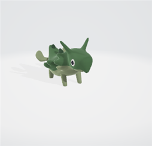
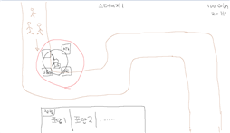

# 프로젝트명: 터렛 디펜스(이지훈)  

 

# 목차  
[1. 프로젝트 소개](#1-프로젝트-소개)  

[2. 컨셉](#2-컨셉)  
+ 메인 컨셉  
+ 서브 컨셉  

[3. 관련 이미지와 동영상](#3-관련-이미지와-동영상)    

[4. 대표 이미지](#4-대표-이미지)  

[5. 컨셉 and 대표이미지 기반 작품묘사](#5-컨셉-and-대표이미지-기반-작품묘사)  

[6. 터렛 디펜스 구성 요소](#6-터렛-디펜스-구성-요소)  
+ 메커니즘  
+ 이야기  
+ 미적요소  
+ 기술

[7. 구성 요소 분석](#7-구성-요소-분석)  
+ 게임 오브젝트 분해  
+ 파라미터(속성) 뽑아 보기   
+ 행동 뽑아 보기   
+ 상태 뽑아 보기  
+ 플레이어 캐릭터 속성(파라미터)  
+ 게임의 규칙  
+ 게임에 사용될 공식  

[8. 개발 요구사항과 흐름도](#8-개발-요구사항과-흐름도)  
+ 요구 사항  
+ 시간별 흐름도 flowchart  
+ 키보드 이벤트에 대한 흐름도  
+ 용어정리  

[9. 스토리보드](#9-스토리보드)  

[10. 알파버전 개발 요구사항](#10-알파버전-개발-요구사항)  

[11. 알파버전 개발작업 일정](#11-알파버전-개발작업-일정)  

[12. 알파버전 주차별 구현 과정](#12-알파버전-주차별-구현-과정)  

 

# 1. 프로젝트 소개  

- 게임명 : 터렛 디펜스  
- 개발자 : 이지훈  
- 개발연도 : 2023  

 

# 2. 컨셉  

## 메인 컨셉 : 전략적  

- 단순히 플레이 하는 것이 아니라 유저가 생각하고 고민하여 실시간으로 상황에 따라 여러 게임 기능과 오브젝트를 이용해 대응한다  
- 다양한 적, 다양한 터렛 그리고 배치가능한 타일과 한정된 재화,시간을 이용해 스테이지를 클리어하며 유저가 전략성을 느끼게 한다  

 

### 서브 컨셉 1 : 다양성  

- 상황과 적의 종류에 따라 대응할 수 있는 기능과 성능을 가진 여러 오브젝트가 존재  
- 각각의 적이 가진 약점을 공략할 수 있는 터렛과 그 외에도 특수한 다른 기능을 가진 터렛들을 제공하여 다양성을 느끼게 한다  

 

### 서브 컨셉 2 : 맵  

- 맵 별로 배치 가능 위치를 조절하여 난이도를 조절해 유저가 고민을 통해 좀 더 효율적인 배치와 타이밍을 찾을 수 있다  
- 적이 오는 길을 제외한 모든 곳에 포탑을 설치할 수 있는 것이 아니라 맵의 구조와 지형지물을 이용해 설치할 수 있는 노드를 조절하여 유저가 고민을 통해 각 상황마다 효율적인 배치를 할 수 있게 만든다. 예를 들면 맵 곳곳에 물이나 낭떨어지 같은 지형을 만들어 그 지형에만 설치할 수 있는 터렛을 사용해야 하게 만든다  
- 맵에 적이 나올 입구를 여러 곳 만들어서 스테이지가 진행되며 적이 번갈아 나오게 하여 한 곳만 막는 것이 아니라 다른 곳도 막게 하여 배치를 고민하게 만든다  
- 최대 50스테이지 정도를 생각중 

 

### 서브 컨셉 3 : 순발력  

- 각 스테이지가 끝날 때 마다 사이사이에 정해진 준비 시간 동안 어떤 적이 몇 명 나올지, 어느 입구에서 나올지 유저에게 알려주어 미리 설치할 장소와 설치할 포탑을 생각하게 하고 스테이지가 뒤로 갈수록 준비 시간을 줄어들게 하여 순발력을 느끼게 한다  
- 준비 시간에 남은 시간은 상단에 표시  
- 적을 잡는 동안 실시간으로 얻는 재화를 이용해 부족한 위치에 터렛을 설치해 순발력 있게 대응하게 한다  

 

### 서브 컨셉 4 : 계산  

- 스테이지가 올라갈수록 적의 체력과 난이도가 올라가기 때문에 실시간으로 대응할 수 있는 터렛을 구매할 재화를 적의 스펙에 맞게 지급하고 스테이지 클리어시 일정량의 재화를 추가로 지급하여 전 스테이지가 진행될 때 실시간으로 사용된 재화를 어느 정도 메꿔주어 준비 시간에 상점에서 다음 스테이지 초반을 버티고 대응할 포탑을 가진 금액에 맞게 효율적으로 계산하여 구매하게 한다  
- 너무 적이 강해져 막는대 실패해서 체력이 줄어들 때 마다 소량의 재화를 추가 지급하여 스테이지를 클리어하는데 도움이 되도록 한다  
- 체력이 줄어들면 클리어시 지급되는 점수나 뱃지같은게 줄어들게 하여 클리어 후 유저가 높은점수를 위해 다시 도전하게 만든다  

 

### 서브 컨셉 5 : 희열감  

- 위에 언급한 기능들을 이용해 스테이지가 진행될 수록 난이도를 점차 올려 클리어시 유저가 희열감을 느끼게 한다  
- 적이 길 끝에 도달시 남은 체력이 깎이게 하여 게임 클리어시 남아 있는 체력 기준으로 점수 또는 뱃지나 별을 지급해 높은 점수일 수록 성취감과 희열감을 느끼게 만든다  

 

### 서브 컨셉 4 : 타격감  

- 각 터렛이 발사하는 탄환의 종류에 맞는 사운드와 이펙트를 넣고 그 포탑을 강화했을 때 업그레이드 된 이펙트를 통해 유저가 자신의 마음에 드는 포탑을 구매하게 만들고 타격감을 느끼게 만든다  

 

[맨위로](#)

  

# 3. 관련 이미지와 동영상  

접기/펼치기 버튼

- 이미지  
  
    
  

- 동영상  
  

  

# 4. 대표 이미지  

접기/펼치기 버튼

  

 

[맨위로](#)

  

# 5. 컨셉 and 대표이미지 기반 작품묘사

- 길을 따라 나오는 몬스터를 각종 터렛을 전략적으로 설치 및 강화하여 끝에 도달하지 않도록 막는다

  

# 6. 터렛 디펜스 구성 요소  

- 여러 터렛을 이용해 적을 막아내는 디펜스 게임  

## 메커니즘  

[도전 과제]  

1. 터렛을 설치하여 몰려오는 적을 끝 지점에 도착하기 전에 모두 쓰러트린다   
2. 최대한 체력을 많이 남겨 높은 점수 또는 뱃지를 얻는다  

[재미 요소]  

1. 스테이지가 진행될수록 적이 단단해지고 끝에 도달 했을 때 들어오는 데미지가 늘어난다  
2. 또한 적이 주는 재화가 점점 늘어나서 여러개의 포탑을 구매하여 설치 할 수 있다  
3. 각기 다른 효과를 지닌 여러 포탑을 구매하여 사용해 볼 수 있다  
4. 클리어 했을 때 남아있는 체력에 따라 점수나 등급 별 뱃지를 받을 수 있다    

 

## 이야기  

[만들게 된 배경]  
전부터 디펜스 게임을 좋아해서 직접 만들어 보고 싶었다  

[카메라 관점]  
탑뷰 화면으로 게임을 진행하여 자신이 원하는 위치에 포탑을 설치 할 수 있게 한다

 

## 미적요소  

[디자인][컬러]  
나오는 적이 스테이지에 따라 달라지고 설치 할 수 있는 포탑들과 포탑의 이펙트가 각기 다른 디자인과 컬러를 가지고 있다  

[음향]  
포탑에서 공격이 나갈 때 소리가 포탑 컨셉에 맞게 각기 다르고 적이 피격하여 이펙트가 터질 때 소리도 이펙트에 맞게 설정한다

 

## 기술  

Unity를 이용해 개발. 플레이 시 마우스 만으로도 플레이 할 수 있게 하고 원한다면 키보드 단축키를 이용해 익숙해진다면 좀 더 빠르고 편리하게 플레이 할 수 있도록 몇몇 기능들을 여러 키에 배치한다  

 

[맨위로](#)

  

# 7. 구성 요소 분석  

## 게임 오브젝트 분해  

접기/펼치기 버튼

|연번|종류|오브젝트 이름|오브젝트 영문명|사용처|오브젝트 이미지|
|:----:|:----:|:----:|:----:|:----:|:----:|
|1|에너미|에너미1_병아리|Enemy1_chick|스테이지 1~4||
|2|보스|보스1_닭|Boss1_chicken|스테이지 5||
|3|에너미|에너미2_새|Enemy2_bird|스테이지 6~9||
|4|보스|보스2_피닉스|Boss2_pheonix|스테이지 10||
|5|에너미|에너미3_양|Enemy3_sheep|스테이지 11~14||
|6|보스|보스3_기린|Boss3_kirin|스테이지 15||
|7|에너미|에너미4_개|Enemy4_dog|스테이지 16~19||
|8|보스|보스4_케르베로스|Boss4_cerberus|스테이지 20||
|9|에너미|에너미5_당나귀|Enemy5_donkey |스테이지 21~24||
|10|보스|보스5_페가수스|Boss5_pegasus|스테이지 25||
|11|에너미|에너미6_젖소|Enemy6_milkcow|스테이지 26~29||
|12|보스|보스6_뿔소|Boss6_horncow|스테이지 30||
|13|에너미|에너미7_돼지|Enemy7_pig|스테이지 31~34||
|14|보스|보스7_고래|Boss7_whale|스테이지 35||
|15|에너미|에너미8_여우|Enemy8_fox|스테이지 36~39||
|16|보스|보스8_구미호|Boss8_kitsune|스테이지 40||
|17|에너미|에너미9_레비아탄|Enemy9_leviathan|스테이지 41~44||
|18|보스|보스9_동양용|Boss9_dragon1|스테이지 45||
|19|에너미|에너미10_와이번|Enemy10_wyvern|스테이지 46~49||
|20|보스|보스10_용|Boss10_dragon2|스테이지 50||
|21|터렛|기본총알터렛|Basicbullet_Turret|공통||
|22|터렛|화염터렛|Fire_Turret|공통||
|23|터렛|폭발터렛|Splash_Turret|공통||
|24|터렛|독터렛|Poison_Turret|공통||
|25|터렛|버프타워|Buff_Tower|공통||
|26|UI|재화|Coin|공통||
|27|UI|체력|HP|공통||
|28|UI|스테이지|Stage|공통||
|29|UI|상점|Shop|공통||
|30|UI|강화|Reinforce|공통||
|31|UI|설정|Setting|공통||

 

[맨위로](#)

 

## 파라미터(속성) 뽑아 보기  

오브젝트 이름 : Basicbullet_Turret, Fire_Turret, Splash_Turret, Poison_Turret, Buff_Tower  

|속성|영문명칭|설명|비고|
|:----:|:----:|:----:|:----:|
|공격력|Turret_Atk|터렛의 공격력||
|공격속도|Turret_Speed|터렛의 공격속도||
|상태|Turret_Status|터렛의 행동상태, 공격, 가격 등||
|레벨|Turret_Level|강화ui에서 강화시 레벨 상승(스텟증가)||

 

오브젝트 이름 : Enemy1\~10, Boss1\~10  

|속성|영문명칭|설명|비고|
|:----:|:----:|:----:|:----:|
|체력|Enemy(Boss)_Hp|각 몬스터와 보스의 체력 수치||
|스피드|Enemy(Boss)_Speed|각 몬스터와 보스의 이동 속도||
|상태|Enemy(Boss)_Status|각 몬스터와 보스의 행동상태, 이동, 체력 등||

 

## 행동 뽑아 보기  

오브젝트 이름 : Basicbullet_Turret, Fire_Turret, Splash_Turret, Poison_Turret, Buff_Tower  

|행동|설명|  
|:----:|:----:|
|조준|몬스터가 터렛 범위에 들어오면 몬스터의 위치 방향으로 머리가 돌아감|
|발사|조준 후에 총구앞에서 총알을 발사|
|유도|발사한 총알이 실시간으로 이동하는 몬스터위치로 유도되어 착탄|
|강화|설치된 포탑을 클릭 시 강화ui가 오픈되고 재화를 사용하여 강화됨|

 

오브젝트 이름 : Enemy1\~10, Boss1\~10  

|행동|설명|
|:----:|:----:|
|스테이지|스테이지 별로 지정된 수량의 각기 다른 몬스터가 나옴|
|웨이브|각 스테이지의 웨이브에서 지정된 몬스터가 각 웨이포인트를 지나 마지막 지점에 도달|
|사망|터렛이 발사한 탄환에 맞고 체력이0이 되면 파괴, 웨이포인트 마지막 지점에 도착해도 파괴|

 

오브젝트 이름 : HP  

|행동|설명|
|:----:|:----:|
|줄어듬|몬스터가 웨이포인트 마지막 지점에 도달하면 최대 hp에서 숫자가 줄어듬|
|패배|hp가 0이 되면 패배하고 게임종료|

 

## 상태 뽑아 보기  

오브젝트 이름 : Basicbullet_Turret, Fire_Turret, Splash_Turret, Poison_Turret, Buff_Tower  

|현상태|전이상태|전이조건|
|:----:|:----:|:----:|
|정상상태|버프상태|버프 타워 반경 안에 설치되어 있을 경우|
|정상상태|강화상태|설치 된 터렛을 클릭하여 강화 창을 열고 재화를 소모하여 공격력 또는 공격속도를 강화한 경우|
|미설치|설치|상점ui에서 원하는 터렛 선택 후 원하는 위치의 노드를 클릭|

 

오브젝트 이름 : Enemy1\~10, Boss1\~10  

|현상태|전이상태|전이조건|
|:----:|:----:|:----:|
|정상상태|부상상태|독 터렛에 피격 시 도트 데미지가 들어온다|
|정상상태|약화상태|버프 타워 반경 안에 진입 시 이동속도가 감소한다|

 

## 플레이어 캐릭터 속성(파라미터)  

- 플레이어 캐릭터가 존재하지 않음

 

[맨위로](#)

 

## 게임 규칙

### 핵심 규칙

1. 유저는 초기 자금으로 상점에서 터렛을 선택하여 원하는 위치 노드에 클릭으로 설치할 수 있음.
2. 몬스터가 길 끝에 도달하면 체력이 줄어들고 0이 될 시 패배한다.
3. 스테이지는 총 50스테이지가 있고 스테이지가 올라갈 때마다 나오는 적의 수가 증가한다.
4. 1~4스테이지는 동일한 몬스터가 숫자만 증가하고 5스테이지 별로 보스가 출현, 스테이지가 늘어나면 몬스터의 체력증가.
5. 설치된 터렛을 클릭하여 강화ui를 열고 공격력과 공격속도를 강화할 수 있다.

 

### 보조 규칙
1. 터렛을 설치할 때 재화가 부족하면 부족하다는 것을 유저에게 인식되게 표시.
2. 스테이지 진행중에도 실시간으로 상점에서 터렛 설치 가능.
3. 일시정지 기능이 있어서 멈춰놓고 어디에 설치할지 생각할 수 있는 시간을 가질 수 있음.

 

[맨위로](#)

 

## 게임에 사용될 공식

### 공격 공식

각 포탑의 Area안에 몬스터의 위치가 있을 경우 설치한 터렛의 총구가 몬스터의 위치로 실시간으로 회전하며 조준.
정해진 발사 tick 이후에 현재 Turret_Speed에 맞춰 적에게 총구 앞 위치에서 Bullet 발사.
몬스터를 Bullet이 타격 시 현재 Enemy_Hp가 현재 Turret_Atk 수치만큼 감소하고 0이 될 시 Enemy, Boss 오브젝트 파괴.

 

### 설치 공식
마우스 포인트로 특정 위치를 클릭하면 클릭한 위치의 좌표를 읽어서 그 좌표의 노드에 터렛이 설치됨.
상점ui에서 설치하고자 하는 포탑을 클릭했을 때만 설치되게 함.

 

[맨위로](#)

  

# 8. 개발 요구사항과 흐름도  

## 요구사항  

### 1. 시작 화면  
1-1. 메인화면, 게임화면, 결과화면 3가지 화면이 있다.  
1-2. 메인화면에는 시작하기, 나가기 2가지 버튼이 있다.  
1-3. 시작하기 버튼을 누르면 게임화면으로 이동하고 나가기 버튼을 누르면 게임이 꺼진다.  

### 2. 게임 화면  
2-1. 게임화면에서는 상단에 스테이지, HP, 코인수가 나오고 하단에는 상점 ui가 나온다.  
2-2. 왼쪽 상단에 일시정지 버튼이 있고 플레이어가 누르면 게임이 정지한다. 스페이스 버튼 또한 가능  
2-3. 왼쪽 상단에 2배속 기능 버튼을 구현한다.
2-4. 터렛을 설치 할 수 있는 맵 노드가 있고 설치를 위해 마우스를 가져다대면 회색으로 강조되어 유저가 인지할 수 있게한다.  
2-5. 조작은 마우스를 이용해 화면 하단 상점에서 원하는 터렛을 클릭하여 설치한다.  
2-6. 상점에는 5종류의 터렛이 있고 각자 정해진 가격이 있다.  
2-7. 설치된 터렛을 클릭하면 강화ui가 나온다.  
2-8. 강화ui에서 코인으로 강화할 수 있다.  
2-9. 마우스를 상하좌우로 화면테두리로 이동하거나 wsad키를 이용해 화면 카메라를 이동할 수 있다.  
2-10. 길의 시작지점에서 몬스터가 스테이지에 맞게 생성된다.  
2-11. 터렛에 죽지 않은 몬스터가 길 끝에 도달시 HP가 깎인다.  
2-12. 총HP는 20, 스테이지는 50
2-13. 게임의 종료 조건은 HP가 0이되면 종료한다.  
2-14. 게임 종료 시 팝업이 뜬다. 팝업에는 잡은 몬스터 수, 플레이타임, 클리어한 최종스테이지, 메인화면 버튼이 있다.  
2-15. 메인화면 버튼을 누르면 게임화면에서 메인화면으로 이동한다.  
2-16. 종료 팝업에서 나온 정보들이 메인화면에 기록창에 따로 저장이 된다.  

### 3. 몬스터  
3-1. 스테이지가 올라갈때마다 몬스터의 수가 늘어나며 4스테이지 간격을 같은 몬스터가 나온다.  
3-2. 5스테이지 마다 좀더 단단하고 빠른 보스 몬스터가 나온다.  
3-3. 몬스터 애니메이션  
3-4. 4스테이지 마다 핸덤하게 1~2마리 씩 속도가 더 빠른 몬스터가 생성된다.  

### 4. 터렛  
4-1. 설치 된 터렛은 특정범위에 몬스터가 들어오면 총구를 몬스터의 위치로 회전하며 공격한다.  
4-2. 모든 공격은 유도된다.  
4-3. 터렛 종류 - 기본터렛, 화염터렛, 폭발터렛, 독터렛 4종류 / 버프타워 1종류 구현  
4-4. 터렛 기능 구현  
4-4-1. 기본터렛 - 일반 총알 발사  
4-4-2. 화염터렛 - 근접한 적에게 화염 발사(지속딜)  
4-4-3. 폭발터렛 - 피격당한 적 주변에게 광격 데미지  
4-4-4. 독터렛 - 피격당한 적이 지속데미지(다시공격시 갱신)  
4-4-5. 버프타워 - 주변 적 슬로우 및 주변터렛 공격력, 공격속도 버프  
4-4-6. 터렛의 종류마다 효과와 공격력, 공격속도, 범위가 다르다.  
4-5. 강화ui에서 코인을 사용해 공격속도와 공격력을 강화할 수 있다.  
4-6. 클릭하여 강화ui에서 제거가 가능하다.  
4-7. 5스테이지 마다 나오는 보스를 클리어 시 원하는 터렛 1회 강화권 제공(무료)  

 

[맨위로](#)

 

## 시간별 흐름도 flowchart  

접기/펼치기 버튼

 

[맨위로](#)

 

## 키보드 이벤트에 대한 흐름도  

접기/펼치기 버튼

 

[맨위로](#)

 

## 용어정리  

접기/펼치기 버튼

 

[맨위로](#)

  

# 9. 스토리보드  

접기/펼치기 버튼

 

[맨위로](#)

  

# 10. 알파버전 개발 요구사항  
(괄호안에는 1년 요구사항 번호)

## 1. 게임 화면  
1-1. 게임화면에서는 상단에 스테이지, HP, 코인수가 나오고 하단에는 상점 ui가 나온다.(2-1)  
1-2. 왼쪽 상단에 일시정지 버튼이 있고 플레이어가 누르면 게임이 정지한다. 스페이스 버튼 또한 가능(2-2)  
1-3. 터렛을 설치 할 수 있는 맵 노드가 있고 설치를 위해 마우스를 가져다대면 회색으로 강조되어 유저가 인지할 수 있게한다.(2-4)  
1-4. 조작은 마우스를 이용해 화면 하단 상점에서 원하는 터렛을 클릭하여 설치한다.(2-5)  
1-5. 상점에는 4종류의 터렛이 있고 각자 정해진 가격이 있다.(2-6)  
1-6. 설치된 터렛을 클릭하면 강화ui가 나온다.(2-7)  
1-7. 강화ui에서 코인으로 강화할 수 있다.(2-8)  
1-8. 마우스를 상하좌우로 화면테두리로 이동하거나 wsad키를 이용해 화면 카메라를 이동할 수 있다.(2-9)  
1-9. 길의 시작지점에서 몬스터가 스테이지에 맞게 생성된다.(2-10)  
1-10. 터렛에 죽지 않은 몬스터가 길 끝에 도달시 HP가 깎인다.(2-11)  
1-11. 총HP는 20, 스테이지는 50(2-12)  
1-12. 게임의 종료 조건은 HP가 0이되면 종료한다.(2-13)  
1-13. 게임 종료 시 팝업이 뜬다. 팝업에는 잡은 몬스터 수, 플레이타임, 클리어한 최종스테이지, 메인화면 버튼이 있다.(2-14)  

## 2. 몬스터  
2-1. 스테이지가 올라갈때마다 몬스터의 수가 늘어나며 4스테이지 간격을 같은 몬스터가 나온다.(3-1)  
2-2. 5스테이지 마다 좀더 단단하고 빠른 보스 몬스터가 나온다.(3-2)  
2-3. 몬스터 애니메이션(3-3)  

## 3. 터렛  
3-1. 설치 된 터렛은 특정범위에 몬스터가 들어오면 총구를 몬스터의 위치로 회전하며 공격한다.)(4-1)  
3-2. 모든 공격은 유도된다.(4-2)  
3-3. 터렛 종류 - 기본터렛, 화염터렛, 폭발터렛, 독터렛 4종류(4-3)  
3-4. 터렛 기능 구현(4-4)  
3-4-1. 기본터렛 - 일반 총알 발사(4-4-1)  
3-4-2. 화염터렛 - 근접한 적에게 화염 발사(지속딜)(4-4-2)  
3-4-3. 폭발터렛 - 피격당한 적 주변에게 광격 데미지(4-4-3)  
3-4-4. 독터렛 - 피격당한 적이 지속데미지(다시공격시 갱신)(4-4-4)  
3-4-5. 터렛의 종류마다 효과와 공격력, 공격속도, 범위가 다르다.(4-4-6)  
3-5. 강화ui에서 코인을 사용해 공격속도와 공격력을 강화할 수 있다.(4-5)  
3-6. 클릭하여 강화ui에서 제거가 가능하다.(4-6)  

 

[맨위로](#)

  

# 11. 알파버전 개발작업 일정   

## 8주차(게임화면의 맵과 카메라 구현)  
1-3. 터렛을 설치 할 수 있는 맵 노드가 있고 설치를 위해 마우스를 가져다대면 회색으로 강조되어 유저가 인지할 수 있게한다.(50%)  
1-8. ~~마우스를 상하좌우로 화면테두리로 이동하거나 wsad키를 이용해 화면 카메라를 이동할 수 있다.~~(100%)  

## 9주차(UI관련 구현)  
1-1. 게임화면에서는 상단에 스테이지, HP, 코인수가 나오고 하단에는 상점 ui가 나온다.  
1-2. 왼쪽 상단에 일시정지 버튼이 있고 플레이어가 누르면 게임이 정지한다. 스페이스 버튼 또한 가능.  
1-4. 조작은 마우스를 이용해 화면 하단 상점에서 원하는 터렛을 클릭하여 맵에 설치한다.  
1-5. 하단 상점에는 4종류의 터렛이 있고 각자 정해진 가격이 있다.(1-5)  
1-11. 총HP는 20, 스테이지는 50  

## 10주차(몬스터 웨이브 시스템(스테이지))  
1-9. 길의 시작지점에서 몬스터가 스테이지에 맞게 생성된다.  
1-10. 터렛에 죽지 않은 몬스터가 길 끝에 도달시 HP가 깎인다.  
2-1. 스테이지가 올라갈때마다 몬스터의 수가 늘어나며 4스테이지 간격을 같은 몬스터가 나온다.  
2-2. 5스테이지 마다 좀더 단단하고 빠른 보스 몬스터가 나온다.  
2-3. 몬스터 애니메이션   

## 11주차(터렛)  
3-1. 설치 된 터렛은 특정범위에 몬스터가 들어오면 총구를 몬스터의 위치로 회전하며 공격한다.  
3-2. 모든 공격은 유도된다.  
3-3. 터렛 종류 - 기본터렛, 화염터렛, 폭발터렛, 독터렛 4종류  
3-4. 터렛 기능 구현  
3-4-1. 기본터렛 - 일반 총알 발사  
3-4-2. 화염터렛 - 근접한 적에게 화염 발사(지속딜)  
3-4-3. 폭발터렛 - 피격당한 적 주변에게 광격 데미지  
3-4-4. 독터렛 - 피격당한 적이 지속데미지(다시공격시 갱신)  
3-4-6. 터렛의 종류마다 효과와 공격력, 공격속도, 범위가 다르다.  

## 12주차(게임 종료 조건과 나머지 UI)
1-12. 게임의 종료 조건은 HP가 0이되면 종료한다.  
1-13. 게임 종료 시 팝업이 뜬다. 팝업에는 잡은 몬스터 수, 플레이타임, 클리어한 최종스테이지, 메인화면 버튼이 있다.  
1-6. 설치된 터렛을 클릭하면 강화ui가 나온다.  

## 13주차(강화 및 제거 기능 구현)  
1-7. 강화ui에서 코인으로 강화할 수 있다.  
3-5. 강화ui에서 코인을 사용해 공격속도와 공격력을 강화할 수 있다.  
3-6. 클릭하여 강화ui에서 제거가 가능하다.  

 

[맨위로](#)

  

# 12. 알파버전 주차별 구현 과정  

## 8주차(게임화면의 맵과 카메라 구현)  
1-3. 터렛을 설치 할 수 있는 맵 노드가 있고 설치를 위해 마우스를 가져다대면 회색으로 강조되어 유저가 인지할 수 있게한다.(50%)  
1-8. ~~마우스를 상하좌우로 화면테두리로 이동하거나 wsad키를 이용해 화면 카메라를 이동할 수 있다.~~(100%)  

### 작업내용  
1-3.  
- ~~3d 오브젝트로 배열하여 노드 생성~~(100%)
- 각각의 노드에 마우스를 올릴 시 색이 회색으로 변하여 유저에게 강조, 나중에 상점ui에서 터렛 설치시 사용(50%)  

1-8.  
- ~~마우스와 키를 이용하여 상하좌우로 화면 이동을 할 수 있게 카메라를 구현~~(100%)
- ~~마우스 휠키를 이용해 화면을 확대하고 축소 할 수 있는 기능을 구현, 스크롤 시 높이의 최대와 최소를 정해주어 땅으로 들어가거나 한도없이 올라가지 않게 만듬~~(100%)
- ~~esc키를 누르면 카메라 고정, 다시 클릭 시 풀림~~(100%)  

### 구현  

 

## 9주차(UI관련 구현)  
1. 게임화면에서는 상단에 스테이지, HP, 코인수가 나오고 하단에는 상점 ui가 나온다.(1-1)  
2. 왼쪽 상단에 일시정지 버튼이 있고 플레이어가 누르면 게임이 정지한다. 스페이스 버튼 또한 가능.(1-2)  
3. 하단 상점에는 4종류의 터렛이 있고 각자 정해진 가격이 있다.(1-5)  
4. 조작은 마우스를 이용해 화면 하단 상점에서 원하는 터렛을 클릭하여 맵에 설치한다.(1-4)
5. 총HP는 20, 스테이지는 50(1-11)  

### 작업내용  

### 구현  

 

## 10주차(몬스터 웨이브 시스템(스테이지))  
1. 길의 시작지점에서 몬스터가 스테이지에 맞게 생성된다.(1-9)
2. 터렛에 죽지 않은 몬스터가 길 끝에 도달시 HP가 깎인다.(1-10)  
3. 스테이지가 올라갈때마다 몬스터의 수가 늘어나며 4스테이지 간격을 같은 몬스터가 나온다.(2-1)  
4. 5스테이지 마다 좀더 단단하고 빠른 보스 몬스터가 나온다.(2-2)  
5. 몬스터 애니메이션(2-3)  

### 작업내용  

### 구현  

 

## 11주차(터렛)  
1. 설치 된 터렛은 특정범위에 몬스터가 들어오면 총구를 몬스터의 위치로 회전하며 공격한다.(3-1)  
2. 모든 공격은 유도된다.(3-2)
3. 터렛 종류 - 기본터렛, 화염터렛, 폭발터렛, 독터렛 4종류(3-3)  
4. 터렛 기능 구현(3-4)  
4-1. 기본터렛 - 일반 총알 발사(3-4-1)  
4-2. 화염터렛 - 근접한 적에게 화염 발사(지속딜)(3-4-2)  
4-3. 폭발터렛 - 피격당한 적 주변에게 광격 데미지(3-4-3)  
4-4. 독터렛 - 피격당한 적이 지속데미지(다시공격시 갱신)(3-4-4)  
4-5. 터렛의 종류마다 효과와 공격력, 공격속도, 범위가 다르다.(3-4-6)  

### 작업내용  

### 구현  

 

## 12주차(게임 종료 조건과 나머지 UI)  
1. 게임의 종료 조건은 HP가 0이되면 종료한다.(1-12)  
2. 게임 종료 시 팝업이 뜬다. 팝업에는 잡은 몬스터 수, 플레이타임, 클리어한 최종스테이지, 메인화면 버튼이 있다.(1-13)  
3. 설치된 터렛을 클릭하면 강화ui가 나온다.(1-6)  

### 작업내용  

### 구현  

 

## 13주차(메인씬 추가 및 UI상호작용)  
1. 강화ui에서 코인으로 강화할 수 있다.(1-7)  
2. 강화ui에서 코인을 사용해 공격속도와 공격력을 강화할 수 있다.(3-5)  
3. 클릭하여 강화ui에서 제거가 가능하다.(3-6)  

### 작업내용  

### 구현  

 

[맨위로](#)

 
