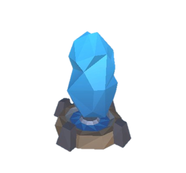

# 프로젝트명: 터렛 디펜스(이지훈)  

 

# 목차  
[1. 프로젝트 소개](#1-프로젝트-소개)  

[2. 게임 특징](#2-게임-특징)  

[3. 대표 이미지](#3-대표-이미지)  

[4. 구성 요소 분석](#4-구성-요소-분석)  
+ 게임 오브젝트 분해    
+ 게임의 규칙
+ 조작법  

[5. 개발 요구사항과 흐름도](#5-개발-요구사항과-흐름도)  
+ 요구 사항  
+ 시간별 흐름도 flowchart  
+ 키보드 이벤트에 대한 흐름도  

[6. 개발 진행 현황](#6-개발-진행-현황)  

[7. 구현 영상](#7-구현-영상)  

 

# 1. 프로젝트 소개  

- 게임명 : 터렛 디펜스  
- 개발자 : 이지훈  
- 개발연도 : 2024  
- 장르 : 전략 디펜스 게임  
- 개발도구 : Unity 3D  
- 플랫폼 : PC  

 

# 2. 게임 특징  

- 총 50스테이지  
- 노드에 터렛을 배치 및 강화하여 생성된 적 오브젝트가 끝지점에 도달하지 못하도록 방어  
- 재화 관리 중요(터렛 구매비용 + 강화 비용 + 판매비용(구매비용의 절반))  
- 일정시간 후에 자동으로 다음 스테이지가 시작되므로 터렛을 필요한 위치에 빠르게 설치하는 순발력 필요  

 

[맨위로](#)

  

# 3. 대표 이미지  

접기/펼치기 버튼

  

 

[맨위로](#)

  

# 4. 구성 요소 분석  

## 게임 오브젝트 분해  

접기/펼치기 버튼

|연번|종류|오브젝트 이름|오브젝트 영문명|사용처|오브젝트 이미지|
|:----:|:----:|:----:|:----:|:----:|:----:|
|1|에너미|에너미1_병아리|Enemy1_chick|스테이지 1~4||
|2|보스|보스1_닭|Boss1_chicken|스테이지 5||
|3|에너미|에너미2_새|Enemy2_bird|스테이지 6~9||
|4|보스|보스2_피닉스|Boss2_pheonix|스테이지 10||
|5|에너미|에너미3_양|Enemy3_sheep|스테이지 11~14||
|6|보스|보스3_기린|Boss3_kirin|스테이지 15||
|7|에너미|에너미4_개|Enemy4_dog|스테이지 16~19||
|8|보스|보스4_케르베로스|Boss4_cerberus|스테이지 20||
|9|에너미|에너미5_당나귀|Enemy5_donkey |스테이지 21~24||
|10|보스|보스5_페가수스|Boss5_pegasus|스테이지 25||
|11|에너미|에너미6_젖소|Enemy6_milkcow|스테이지 26~29||
|12|보스|보스6_뿔소|Boss6_horncow|스테이지 30||
|13|에너미|에너미7_돼지|Enemy7_pig|스테이지 31~34||
|14|보스|보스7_고래|Boss7_whale|스테이지 35||
|15|에너미|에너미8_여우|Enemy8_fox|스테이지 36~39||
|16|보스|보스8_구미호|Boss8_kitsune|스테이지 40||
|17|에너미|에너미9_레비아탄|Enemy9_leviathan|스테이지 41~44||
|18|보스|보스9_동양용|Boss9_dragon1|스테이지 45||
|19|에너미|에너미10_와이번|Enemy10_wyvern|스테이지 46~49||
|20|보스|보스10_용|Boss10_dragon2|스테이지 50||
|21|터렛|기본총알터렛|Basicbullet_Turret|공통||
|22|터렛|화염터렛|Fire_Turret|공통||
|23|터렛|폭발터렛|Splash_Turret|공통||
|24|터렛|독터렛|Poison_Turret|공통||
|25|터렛|버프타워|Buff_Tower|공통||

 

[맨위로](#)

 

## 게임 규칙  

### 핵심 규칙  

1. 유저는 초기 자금으로 상점에서 터렛을 선택하여 원하는 위치 노드에 클릭으로 설치할 수 있음.  
2. 몬스터가 길 끝에 도달하면 체력이 줄어들고 0이 될 시 패배한다.  
3. 스테이지는 총 50스테이지가 있고 스테이지가 올라갈 때마다 나오는 적의 수가 증가한다.  
4. 1~4스테이지는 동일한 몬스터가 숫자만 증가하고 5스테이지 별로 보스가 출현, 스테이지가 늘어나면 몬스터의 체력증가.  
5. 설치된 터렛을 클릭하여 강화ui를 열고 공격력과 공격속도를 강화할 수 있다.  

 

### 보조 규칙  
1. 터렛을 설치할 때 재화가 부족하면 부족하다는 것을 유저에게 인식되게 표시.  
2. 스테이지 진행중에도 실시간으로 상점에서 터렛 설치 가능.  
3. 일시정지 기능이 있어서 멈춰놓고 어디에 설치할지 생각할 수 있는 시간을 가질 수 있음.  
4. 배속 기능(2배속)  

 

[맨위로](#)  

 

## 조작법  

1. 카메라 조작 : wasd 키 + 휠스크롤로 확대 축소  
2. 화면고정 : esc 키  
3. 일시정지 : space 키 or 왼쪽 상단 버튼  
4. 배속 및 설정 : 왼쪽 상단 버튼 - 배속 버튼은 2배속/설정버튼은 사운드 조절 가능  
5. 상점구매 : 하단 터렛이미지를 클릭하여 배치  
6. 강화 및 판매 : 설치된 터렛을 클릭시 나오는 버튼  
7. 재시작 및 종료 : 설정창의 버튼 클릭 or 게임 종료UI의 버튼 클릭  

 

[맨위로](#)  

  

# 5. 개발 요구사항과 흐름도  

## 요구사항  

### 1. 시작 화면  
1. 메인화면, 게임화면, 결과화면 3가지 화면이 있다.  
2. 메인화면에는 시작하기, 나가기 2가지 버튼이 있다.  
3. 시작하기 버튼을 누르면 게임화면으로 이동하고 나가기 버튼을 누르면 게임이 꺼진다.  

### 2. 게임 화면  
1. 게임화면에서는 상단에 스테이지, HP, 스테이지 타이머 UI가 나오고 하단에는 상점 UI, 보유 재화UI가 나온다.  
2. 왼쪽 상단에 일시정지 버튼이 있고 플레이어가 누르면 게임이 정지한다. 스페이스 버튼 또한 가능.  
3. 왼쪽 상단에 2배속 기능 버튼을 구현한다.  
4. 왼쪽 상단에 도움말 버튼을 배치하고 클릭 시 그 아래에 UI를 팝업시켜 조작방법을 텍스트로 표시.  
5. 왼쪽 상단에 설정 버튼을 배치하여 클릭 시 사운드를 조절할 수 있는 슬라이드 바 배치.  
6. 숲 배경으로 맵 구현.  
7. 터렛을 설치 할 수 있는 맵 노드가 있고 설치를 위해 마우스를 가져다대면 회색으로 강조되어 유저가 인지할 수 있게한다.  
8. 조작은 마우스를 이용해 화면 하단 상점에서 원하는 터렛을 클릭하여 설치한다.  
9. 상점에는 5종류의 터렛이 있고 각자 정해진 가격이 있다.  
10. 설치된 터렛을 클릭하면 강화 및 판매ui가 나온다.  
11. 강화ui에서 재화로 강화할 수 있다.  
12. wsad키를 이용해 화면 카메라를 이동할 수 있고 마우스 휠로 화면을 확대하거나 축소할 수 있다.  
13. 길의 시작지점에서 몬스터가 스테이지에 맞게 생성된다.  
14. 터렛에 죽지 않은 몬스터가 길 끝에 도달시 HP가 깎인다.  
15. 총HP는 20, 스테이지는 50.  
16. 게임의 종료 조건은 HP가 0이되면 종료한다.  
17. 게임 종료 시 팝업이 뜬다. 팝업에는 클리어한 최종스테이지, 재시작 버튼, 종료 버튼이 있다.  
18. 재시작 버튼을 누르면 현재 씬 재시작.   
19. 종료 팝업에서 나온 정보들이 메인화면에 기록창에 따로 저장이 된다.  

### 3. 몬스터  
1. 스테이지가 올라갈때마다 몬스터의 수가 늘어나며 4스테이지 간격을 같은 몬스터가 나온다.  
2. 5스테이지 마다 좀더 단단하고 빠른 보스 몬스터가 나온다.  
3. 몬스터 애니메이션  
4. 4스테이지 마다 랜덤하게 1~2마리 씩 속도가 더 빠른 몬스터가 생성된다.  
5. 유저가 원하는 타이밍에 소환가능한 잡을 시 추가 재화를 지급하는 보스몬스터 기능 구현.  

### 4. 터렛  
1. 설치 된 터렛은 특정범위에 몬스터가 들어오면 총구를 몬스터의 위치로 회전하며 공격한다.  
2. 모든 공격은 유도된다.  
3. 터렛 종류 - 기본터렛, 화염터렛, 폭발터렛, 장판터렛 4종류 / 버프타워 1종류 구현.  
4. 터렛 기능 구현  
4-1. 기본터렛 - 일반 총알 발사, 제일 빠른 공격속도, 평균적인 공격력, 평균적인 범위.  
4-2. 화염터렛 - 근접한 적에게 화염 발사(지속딜), 발사 후 타겟팅 전환에 딜레이, 도트딜에 맞게 데미지 감폭, 넓은 범위.  
4-3. 폭발터렛 - 피격당한 적 주변에게 광격 데미지, 넓은 범위, 높은 데미지.  
4-4. 장판터렛 - 밟으면 지속적인 데미지를 주는 장판설치, 넓은 범위, 느린 공격속도, 평균적인 공격력.    
4-5. 버프타워 - 주변 적 슬로우 및 주변터렛 공격력, 공격속도 버프.  
4-6. 터렛의 종류마다 효과와 공격력, 공격속도, 범위가 다르다.  
4-7. 각 터렛에 맞는 파티클 배치.  
6. 강화UI에서 코인을 사용해 공격속도와 공격력을 강화할 수 있다.
7. 터렛을 강화하면 업그레이드된 오브젝트로 교체 및 파티클 업그레이드
8. 판매UI에서 구매금액의 절반가격으로 되팔수 있다. 
9. 5스테이지 마다 나오는 보스를 클리어 시 원하는 터렛 1회 강화권 제공(무료)  

 

[맨위로](#)

 

## 시간별 흐름도 flowchart  

접기/펼치기 버튼

 

[맨위로](#)

 

## 키보드 이벤트에 대한 흐름도  

접기/펼치기 버튼

 

[맨위로](#)

  

# 6. 개발 진행 현황  

### 1. 시작 화면  
~~1. 메인화면, 게임화면, 결과화면 3가지 화면이 있다.~~  
~~2. 메인화면에는 시작하기, 나가기 2가지 버튼이 있다.~~  
~~3. 시작하기 버튼을 누르면 게임화면으로 이동하고 나가기 버튼을 누르면 게임이 꺼진다.~~  

### 2. 게임 화면  
~~1. 게임화면에서는 상단에 스테이지, HP, 스테이지 타이머 UI가 나오고 하단에는 상점 UI, 보유 재화UI가 나온다.~~  
~~2. 왼쪽 상단에 일시정지 버튼이 있고 플레이어가 누르면 게임이 정지한다. 스페이스 버튼 또한 가능.~~  
~~3. 왼쪽 상단에 2배속 기능 버튼을 구현한다.~~  
~~4. 왼쪽 상단에 도움말 버튼을 배치하고 클릭 시 그 아래에 UI를 팝업시켜 조작방법을 텍스트로 표시.~~  
~~5. 왼쪽 상단에 설정 버튼을 배치하여 클릭 시 사운드를 조절할 수 있는 슬라이드 바 배치.~~  
~~6. 숲 배경으로 맵 구현.~~  
~~7. 터렛을 설치 할 수 있는 맵 노드가 있고 설치를 위해 마우스를 가져다대면 회색으로 강조되어 유저가 인지할 수 있게한다.~~  
~~8. 조작은 마우스를 이용해 화면 하단 상점에서 원하는 터렛을 클릭하여 설치한다.~~  
~~9. 보유재화가 부족할 시 빨간색으로 강조되어 설치할 수 없다는 것을 유저에게 인식.~~  
~~10. 상점에는 5종류의 터렛이 있고 각자 정해진 가격이 있다.~~  
~~11. 설치된 터렛을 클릭하면 강화 및 판매ui가 나온다.~~  
~~12. 강화ui에서 재화로 강화할 수 있다.~~  
~~13. wsad키를 이용해 화면 카메라를 이동할 수 있고 마우스 휠로 화면을 확대하거나 축소할 수 있다.~~  
~~14. 길의 시작지점에서 몬스터가 스테이지에 맞게 생성된다.~~  
~~15. 터렛에 죽지 않은 몬스터가 길 끝에 도달시 HP가 깎인다.~~  
~~16. 총HP는 20, 스테이지는 50.~~  
~~17. 게임의 종료 조건은 HP가 0이되면 종료한다.~~  
~~18. 게임 종료 시 팝업이 뜬다. 팝업에는 클리어한 최종스테이지, 재시작 버튼, 종료 버튼이 있다.~~
~~19. 재시작 버튼을 누르면 현재 씬 재시작.~~   
20. 종료 팝업에서 나온 정보들이 메인화면에 기록창에 따로 저장이 된다.(0%)  

### 3. 몬스터  
~~1. 스테이지가 올라갈때마다 몬스터의 수가 늘어나며 4스테이지 간격을 같은 몬스터가 나온다.~~  
2. 5스테이지 마다 좀더 단단하고 빠른 보스 몬스터가 나온다.(70%)  
~~3. 몬스터 애니메이션.~~  
4. 4스테이지 마다 랜덤하게 1~2마리 씩 속도가 더 빠른 몬스터가 생성된다.(50%)  
5. 유저가 원하는 타이밍에 소환가능한 잡을 시 추가 재화를 지급하는 보스몬스터 기능 구현.(0%)  

### 4. 터렛  
~~1. 설치 된 터렛은 특정범위에 몬스터가 들어오면 총구를 몬스터의 위치로 회전하며 공격한다.~~  
~~2. 모든 공격은 유도된다.~~  
~~3. 터렛 종류 - 기본터렛, 화염터렛, 폭발터렛, 장판터렛 4종류 / 버프타워 1종류 구현.~~  
4. 터렛 기능 구현  
~~4-1. 기본터렛 - 일반 총알 발사, 제일 빠른 공격속도, 평균적인 공격력, 평균적인 범위.~~  
~~4-2. 화염터렛 - 근접한 적에게 화염 발사(지속딜), 발사 후 타겟팅 전환에 딜레이, 도트딜에 맞게 데미지 감폭, 넓은 범위.~~  
~~4-3. 폭발터렛 - 피격당한 적 주변에게 광격 데미지, 넓은 범위, 높은 데미지.~~  
~~4-4. 장판터렛 - 밟으면 지속적인 데미지를 주는 장판설치, 넓은 범위, 느린 공격속도, 평균적인 공격력.~~    
4-5. 버프타워 - 주변 적 슬로우 및 주변터렛 공격력, 공격속도 버프.(50%)  
~~4-6. 터렛의 종류마다 효과와 공격력, 공격속도, 범위가 다르다.~~  
~~4-7. 각 터렛에 맞는 파티클 배치.~~  
~~6. 강화UI에서 코인을 사용해 공격속도와 공격력을 강화할 수 있다.~~
7. 터렛을 강화하면 업그레이드된 오브젝트로 교체 및 파티클 업그레이드.(50%)  
~~8. 판매UI에서 구매금액의 절반가격으로 되팔수 있다.~~ 
9. 5스테이지 마다 나오는 보스를 클리어 시 원하는 터렛 1회 강화권 제공(무료)(0%)  

 

[맨위로](#)  

  

# 7. 구현 영상  

 

[맨위로](#)

  
